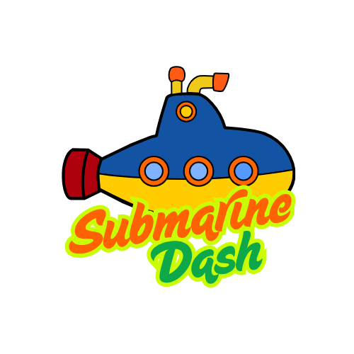

<p align="center">
  
</p>

# Submarine Dash

A browser-based survival game where you pilot a submarine through underwater hazards. Keep your submarine balanced, dodge obstacles, collect oxygen, and survive as long as you can.

---

## How to Play

- Press **Space** or **Arrow Up** to thrust upward
- Gravity pulls the submarine down — keep it balanced
- Avoid **pipes** or you'll lose oxygen
- Collect **oxygen tanks** to refill your supply
- Grab **boosters** for temporary invincibility
- Your oxygen runs out → game over

---

## Difficulty Modes

| Mode   | Obstacle Speed | Missiles | Oxygen Penalty |
|--------|----------------|----------|----------------|
| Easy   | Slow           | No       | 25             |
| Medium | Moderate       | Yes      | 30             |
| Hard   | Fast           | Yes      | 35             |

---

## Features

- Smooth physics with gravity and velocity
- Animated CSS submarine _(design credit: [Akhil Sai](https://codepen.io/akhil_001/pen/gQwJPJ))_
- Oxygen drain system with visual bar
- Booster power-up (temporary invincibility)
- Missiles in Medium and Hard mode
- High score leaderboard (top 3, saved in localStorage)
- Background music + sound effects with mute toggle
- Game over screen with final score summary

---

## Methods Used

**JavaScript**
- `requestAnimationFrame()` — smooth 60fps game loop
- `setInterval()` / `setTimeout()` — obstacle spawning, countdown, hit recovery
- `getBoundingClientRect()` — pixel-accurate collision detection
- `localStorage.getItem()` / `setItem()` — persistent high score storage
- `JSON.parse()` / `JSON.stringify()` — serialize scores to/from localStorage
- `Array.sort()`, `Array.splice()`, `Array.push()` — score management and entity cleanup
- `Math.max()` / `Math.min()` — clamping oxygen level within 0–100
- `new Audio()` / `.play()` / `.pause()` — sound effects and background music
- `classList.add()` / `remove()` / `toggle()` — UI state management

**CSS**
- `@keyframes` — submarine animations and invincibility blink
- `flexbox` — layout for all screens
- `position: absolute` — game entity placement
- CSS custom classes for HUD, overlays, and game states

---

## Tech Stack

- **HTML5** — structure
- **CSS3** — animations, layout, submarine design
- **Vanilla JavaScript** — game loop, physics, collision detection

No frameworks. No build tools. Just plain frontend.

---

## Project Structure

```
submarine-dash/
├── index.html
├── css/
│   └── style.css
├── js/
│   ├── config.js       # Game constants and tuning values
│   ├── game.js         # Core game loop and collision logic
│   ├── player.js       # Submarine physics and hit handling
│   ├── obstacles.js    # Pipe spawning and movement
│   ├── oxygen.js       # Oxygen tank spawning
│   ├── booster.js      # Booster power-up logic
│   └── main.js         # Event listeners and difficulty select
└── assets/
    ├── audio/          # Sound effects and music
    ├── images/         # Logos and UI images
    ├── obstacles/      # Pipe and missile sprites
    └── decor/          # Seaweed, oxygen tank, icons
```

---

## Getting Started

Just open `index.html` in a browser — no installation needed.

> For the best experience use a Chromium-based browser (Chrome, Edge) with Live Server in VS Code.

---

## Author

Made by **Ali Saad** — Ironhack Web Development Bootcamp, 2026

_README written with AI assistance._
